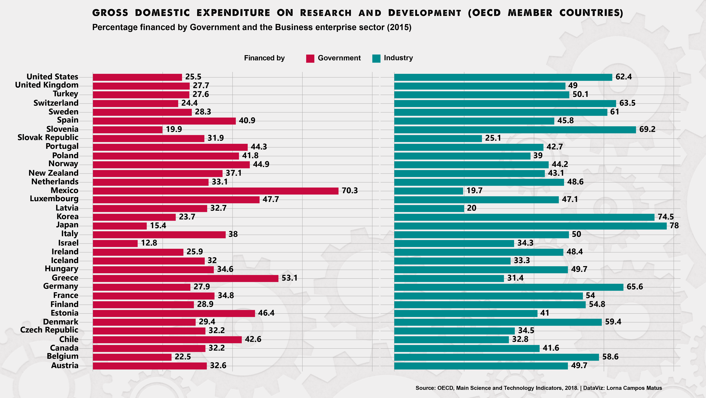
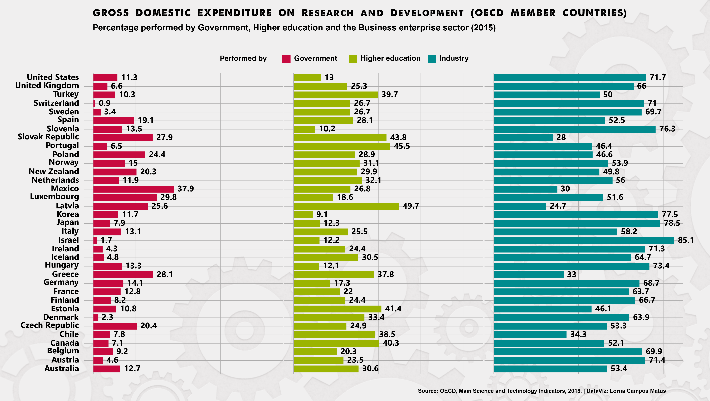

```{r setup, include=FALSE}
knitr::opts_chunk$set(echo = TRUE)
```

# ¿Which are the trends from the OECD member countries?


R&D plays a leading role in the innovation process of any country. It's key in gaining competitive advantages that favor education, technology, science and all those areas that generate economic and social development.

The following visualizations combine insights from the OECD's publication, <h1>"Main Science and Technology Indicators"</h1>(https://www.oecd-ilibrary.org/science-and-technology/main-science-and-technology-indicators_2304277x), with the goal of showing the state of R&D in member countries.

**NOTE | OECD member countries**: Australia, Austria, Belgium, Canada, Chile, Czech Republic, Denmark, Estonia, Finland, France, Germany, Greece, Hungary, Iceland, Ireland, Israel, Italy, Japan, Korea, Latvia, Luxembourg, Mexico, the Netherlands, New Zealand, Norway, Poland, Portugal, Slovak Republic, Slovenia, Spain, Sweden, Switzerland, Turkey, United Kingdom, and United States.


# Loading libraries


```{r}
library(readxl)                 # load data in xlsx format
library(dplyr)                  # work with dataframes
library(ggplot2)                # create plots
library(sf)                     # encode spatial vector data
library(rnaturalearthdata)      # world vector map data
library(leaflet)                # create interactive maps
library(extrafont)              # fonts
```


# Importing data


```{r}
GDE_on_R_D <- read_excel("data/GDE_on_R_D.xlsx")
```


# Tidying database and creating dataframes


**Dataframe 1: Percentage financed by Government and Industry**

```{r}
financed <- GDE_on_R_D %>%
  select(country, region, percentage_financed_by, financed_by) %>% 
  filter(financed_by %in% c("Industry", "Government"))

head(financed)
```


**Dataframe 2: Percentage performed by Government, Higher education and Industry**

```{r}
performed <- GDE_on_R_D %>%
  select(country, region, percentage_performed_by, performed_by) %>% 
  filter(performed_by %in% c("Industry", "Higher education", "Government"))

head(performed)
```


**Dataframe 3: Total researchers in full time**

```{r}
researchers <- GDE_on_R_D %>%
  select(country, total_researchers_in_full_time, year) %>% 
  filter(year=="2015")

head(researchers)
```


# Creating Bar Plots


### Visualizing the percentage financed by Government and Industry

```{r, eval=FALSE}
ggplot(financed, 
       aes(x=country, y=percentage_financed_by, fill=financed_by)) +
  geom_bar(stat="identity", width = .8) +
  coord_flip() +
  facet_grid(.~ financed_by) +
  labs(x="", y="", fill="Financed by",
       title = "GROSS DOMESTIC EXPENDITURE ON R&D (OECD MEMBER COUNTRIES)",
       subtitle = "Percentage financed by Government and the Business enterprise sector (2015)",
       caption = "Source: OECD, Main Science and Technology Indicators, 2018. | DataViz: Lorna Campos Matus") +
  theme_minimal() +
  geom_text(aes(label=percentage_financed_by), color="black", family="Arial Rounded MT Bold", size=3, vjust=.38, hjust=-.3)+
  theme(strip.background = element_blank(),
        strip.text.x = element_blank(), 
        axis.text.x = element_blank(),
        axis.text=element_text(size=10, color = "black"),
        title=element_text(color="black",size=10, family="A Love of Thunder")) +
  scale_fill_manual(values=c("#c7093f", "#008b8e")) + 
  scale_color_manual(values=c("#c7093f"="Government", "#008b8e"="Industry"))
```

```{r pressure, fig.cap="No data recorded for Australia", out.width = '100%'}

```

### Visualizing the percentage performed by Government, Higher education and Industry

```{r, eval=FALSE}
ggplot(performed, 
       aes(x=country, y=percentage_performed_by, fill=performed_by)) +
  geom_bar(stat="identity") +
  coord_flip() +
  facet_grid(.~performed_by) +
  labs(x="", y="", fill="Performed by",
       title = "GROSS DOMESTIC EXPENDITURE ON R&D (OECD MEMBER COUNTRIES)",
       subtitle = "Percentage performed by Government, Higher education and the Business enterprise sector (2015)",
       caption = "Source: OECD, Main Science and Technology Indicators, 2018. | DataViz: Lorna Campos Matus") +
  theme_hc() +
  geom_text(aes(label=percentage_performed_by), color="black", family="Arial Rounded MT Bold", size=3, vjust=.38, hjust=-.3)+
  theme(strip.background = element_blank(),
        strip.text.x = element_blank(), 
        axis.text.x = element_blank(),
        axis.text=element_text(size=10, color = "black"),
        title=element_text(color="black",size=10, family="A Love of Thunder")) +
  scale_fill_manual(values=c("#c7093f", "#9bb401", "#008b8e")) + 
  scale_color_manual(values=c("#c7093f"="Government", "#9bb401"="Higher education", "#008b8e"="Industry"))
```

```{r, out.width = '100%'}

```


# Designing an interactive choropleth map


**Let's start by getting global data and geometries from Natural Earth**

```{r}
Map.stat <- st_as_sf(countries50) %>% 
  select(name, geometry)
```

**Joining and filtering data with geometries**

```{r}
Map.stat1 <-left_join(Map.stat, researchers, by=c("name"="country")) %>% 
  filter(name!="Antarctica", !is.na(total_researchers_in_full_time)) %>% 
  select(name, total_researchers_in_full_time, geometry)

head(Map.stat1)
```

**Creating the sequential palette**

```{r}
palette <- colorNumeric(c("#f8d6ea", "#dd86e3", "#ca22b9", "#d53091", "#d5047f", "#a50288"), 
                        domain=Map.stat1$total_researchers_in_full_time)
```

**Setting up the pop up text**

```{r}
popup_sb <- paste0("<b>", Map.stat1$name,"</b><br/>",
                   as.character(round(Map.stat1$total_researchers_in_full_time, 1))) %>% 
  lapply(htmltools::HTML)
```

**Now, let's go to the map!**

```{r, out.width = '100%', fig.cap="No data recorded for Australia, Canada, Israel and Mexico"}
leaflet(Map.stat1) %>%
  addTiles() %>%
  setView(25.670689, 35.286792, zoom = 2) %>%
  addPolygons(data = Map.stat1, 
              fillColor = ~palette(total_researchers_in_full_time), 
              fillOpacity = .8, 
              weight = .8, 
              smoothFactor = .2,
              highlight = highlightOptions(
                weight = 3,
                color = "ghostwhite",
                fillOpacity = .9,
                bringToFront = TRUE),
              label=popup_sb,
              labelOptions = labelOptions(
                style = list("font-weight" = "normal", padding = "3px 8px"),
                textsize = "13px",
                direction = "auto")) %>%
  addLegend(pal = palette, values = ~total_researchers_in_full_time, 
            position = "bottomright", 
            title = "Total researchers<br />in full time equivalent")
```


# What does the data tell us?


- Mexico registers the highest percentage of government financing, surpassing by 17.2 percent points to second-place, Greece.
- Japan and Korea register the highest percentage financed by business enterprise sector, reaching 78 % and 74.5 %, respectively.
- Mexico leads the percentage performed R&D tasks by government (37.9 %); Latvia, by higher education (49.7 %), and Israel, by the business enterprise sector (85.1 %).
- Precisely, this sector is the one that reach first place in the percentage performed R&D tasks in OECD member countries.
- And what about the map? Most full-time researchers are located in U.S. (1.379.977), Japan (662.071), Germany (387.982), and Korea (356.447). While, on the opposite side, there's  Iceland (1.944), Luxembourg (2.539), Latvia (3.613), and Estonia (4.187).
